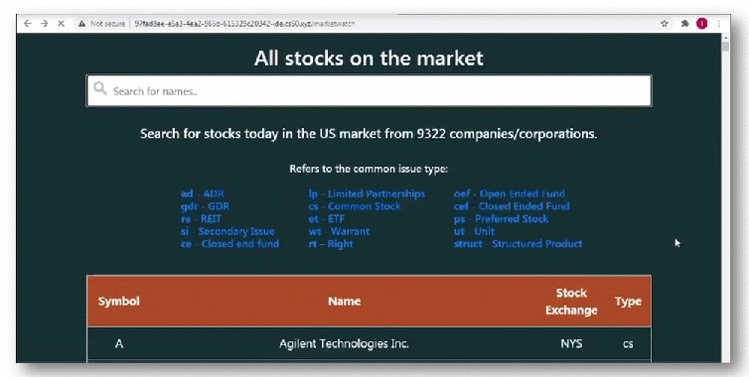
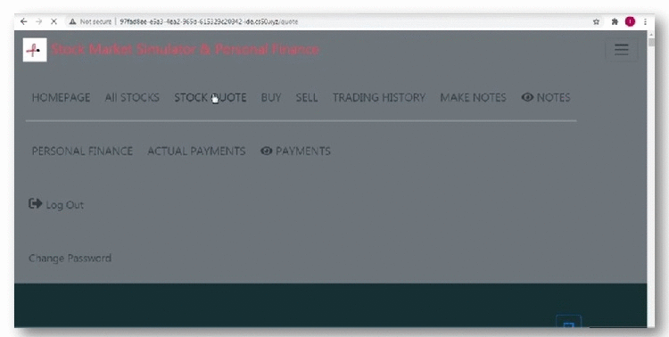
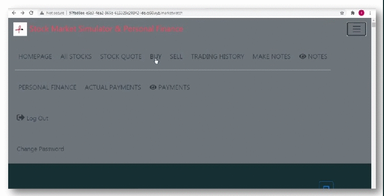
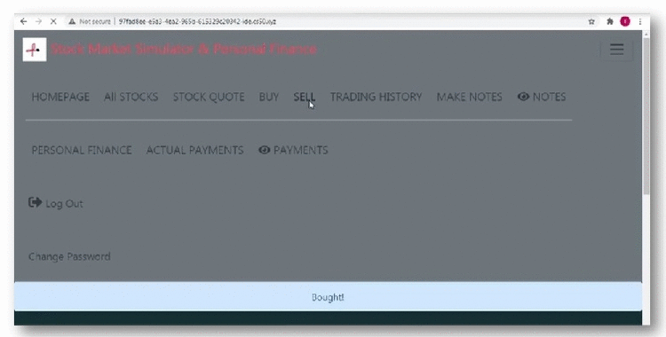
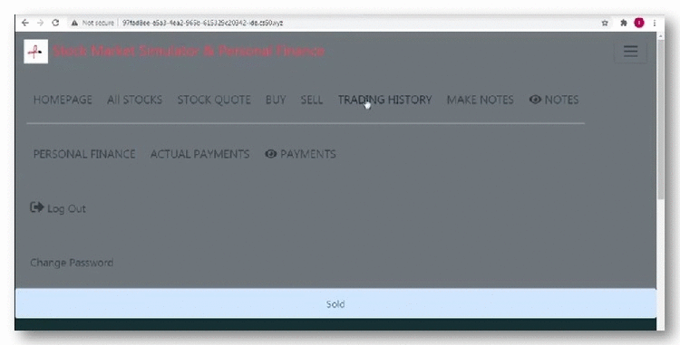
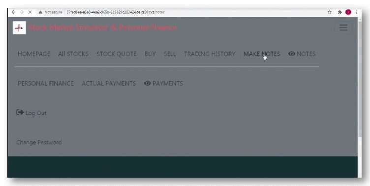
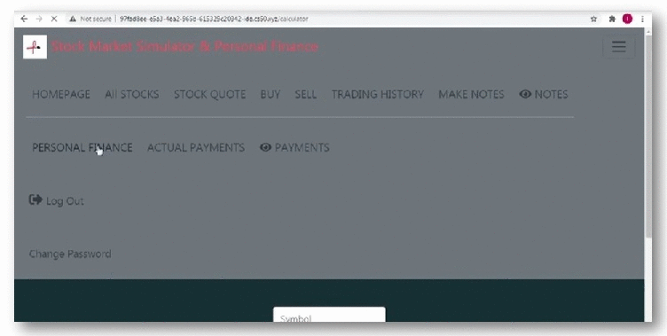
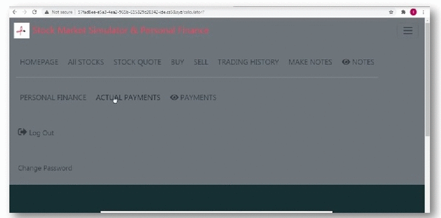

### STOCK MARKET SIMULATOR & PERSONAL FINANCE 
 ***
 
 
This is a web-based application for ***stock trading*** practice where users can create an account, see all companies on the market with explanation regarding their stocks, get company profile, quote stock and view stock performance on the market. 
On the other hand, users will have the ability to ***organize their own finances***, by knowing how much they should spend _(information collected from many analyzes of the consumers data and economy sector then given a “frame of estimated spendings”)_ and how much they actually spend. As written on the website:

>_This website will help you gain more knowledge with the stock market, practice stock buying, selling and quoting, as well more organized personal finances._


## Table of Contents
* Register
* Log in
* Log out
* Change password
#### Stock market simulator
* **Homepage** is the portfolio page where user can see how many shares owns, as well ***buy*** and ***sell*** shares from the same page.

|   Symbol    |    Name       |    Shares    |    Price    |    Total    |
|    :----:   |    :---:      |    :----:    |    :----:   |    :----:   |
|    AAPL     |  Apple,Inc    |       7      |    $113.85  |    $796.95  |
|    NFLX     |  Netflix,Inc  |       2      |    $476.62  |    $953.24  |
|    cash     |               |              |             |   $8,249.81 |
|             |               |              |             | $10,000.00  |

_If the user just register and didn't bought any shares the portfolio shows only his cash._

|   Symbol    |    Name       |    Shares    |    Price    |    Total    |
|    :----:   |    :---:      |    :----:    |    :----:   |    :----:   |
|    cash     |               |              |             | $10,000.00  |
|             |               |              |             | $10,000.00  |

   
***
 * **All Stocks** option is made for the user to search the *stock symbol* in the `<input>` field which is functional with   _Javascript_, by typing the company/corporation name, as well to learn about the *stock type*, when :hover over, the text  shows in a text box with a class "tooltip". With clicking the upper right icon the user can make notes.
 working in `python` with:
 ```python
 import os
 import requests
 import urlib.parse
 ```
 Taking data from IEX cloud through `/ref-data/symbols` endpoint I have created search engine that by typing _Company Name_ result shows **Stock Symbol**, **Company Name** and **Type** of shares from the company in the US Stock Market. Or you can scroll down through the page and see all Companies in the US Market. 
 <details>
<summary>View All Stocks</summary>
               
 
 
</details>

***

* **Stock Quote** is an option where the user can type in the stock symbol and get current stock price as a text, view company profile in a modal window, and stock performance, ***Line Chart***. I made company profile with IEX cloud endpoint `/company` , `GET stable/stock/{symbol}/company`.
```python
response = requests.get(f"https://cloud-sse.iexapis.com/stable/stock/{urllib.parse.quote_plus(symbol)}/company?token={api_key}")
``` 
With
```python
import requests
import urllib.parse
```
the symbol that was entered by the user is parsed and it gets the information. Then parse the response with :
```python
quote = response.json()
```
and create a data object:
```json
{
            "comName": quote["companyName"],
            "employees": quote["employees"],
            "exchange": quote["exchange"],
            "industry": quote["industry"],
            "description": quote["description"],
            "CEO": quote["CEO"],
            "issueType": quote["issueType"],
            "sector": quote["sector"],
            "address": quote["address"],
            "state": quote["state"],
            "city": quote["city"],
            "zip": quote["zip"],
            "country": quote["country"],
            "phone": quote["phone"]

 }
 ```
Since the data from the API call is returned in the form of a dictionary, I converted the value of each key into a list, then save it into variables and sent to `<html>` `{{ jinja }}`.
For the Chart I have used the IEX cloud endpoint `/chart/1m` `GET stable/stock/{symbol}/chart/1m`
```python
response = requests.get(f"https://cloud-sse.iexapis.com/stable/stock/{urllib.parse.quote_plus(symbol)}/chart/1m?token={api_key}")
```
Then parse the response:
```python
chart = response.json()
```
and iterate through the values in the `dataObject` in the response and save it in a list, then send to `<html>` 
<details>
<summary>View Stock Quote</summary>
 
  
 
</details>
 
 ***  
*  **Buy Stocks** prompts the user to enter stock symbol and number of shares that wants to buy and after submit the form it redirects to the home page/portfolio, where the bought stocks are seen. _Moreover_, stocks can be bought directly from the portfolio page. 
<details>
<summary>View Buy Stocks</summary>
 


</details>
   
***
* **Sell Stocks** option has `<select>` drop-down list with symbols of already bought stocks to choose and number of shares to sell, on submit form redirects to portfolio/homepage where you can see the sold stocks and you can sell as well from there.

<details>
<summary>View Sell Stocks</summary>
   
 
 
</details>

***
* **Trading History** option shows to the user a table with all stock tradings he made and contains a ***date-time filter***
<details>
<summary>View History</summary>



</details>

***
* **Make Notes**. While practicing stock trading this option serves the user to take notes, has field to enter *Symbol*, *Note Name* and `<textarea>`(#note) *text field*, and it can only be added if the *text field* is filed. 
```js
document.querySelector('#note').onkeyup = function() {
            if(document.querySelector('#note').value === '') {
                document.querySelector('#submit').disabled  = true;
            } else {
                document.querySelector('#submit').disabled  = false;
            }
        };
```
<details>
<summary>View Make Notes</summary>
 


</details>

***
* **View Notes** to view the entered notes, delete it and save it. _(you can view in **Make Notes**)_. 

### Personal Finance

* **Personal Finance** is a calculator where the user can enter the income amount (by month or year) to get an estimated payments, as it says on the website:
>_Personal finances and organizing them is very important task for successful living. By entering your income amount in the field bellow, you will get an estimated results of how much your spending should be._

The payments are shown with a table that has hoverable content that displays text with a class "tooltip", and comparable  ***Bar Chart***.
<details>
<summary>View Personal Finance</summary>



</details>

***
* **Actual Payments** is a montly payments that the user actually has and can keep record of it. 
<details>
<summary>View Personal Finance</summary>
 


</details>

***
* **View Payments** is the table for records of all the payments submitted for every month and calculated sum for the year.
    *  Besides the `<table>` element presentation, the payments are presented with `<canvas>` element  ***Pie Chart*** . _(You can view in **Actual Payments**)_
    
#### Used for this website are JavaScript, Python, and SQL.

